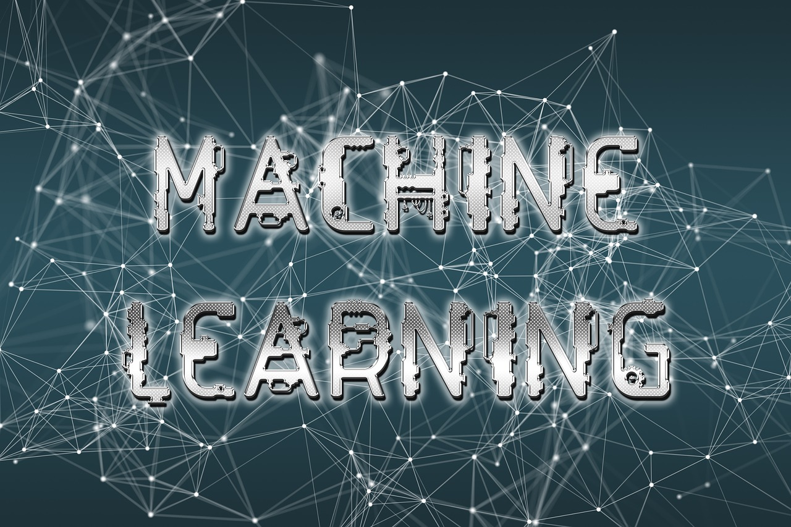

# Machine Learning Overview

## Basic Concepts

1. **Supervised Learning**: The algorithm learns from labeled training data, making predictions based on input-output pairs. Examples include:

   - **Regression**: Predicting continuous values (e.g., house prices).
   - **Classification**: Predicting categorical values (e.g., spam detection).

2. **Unsupervised Learning**: The algorithm identifies patterns in data without labels. Examples include:

   - **Clustering**: Grouping similar data points (e.g., customer segmentation).
   - **Association**: Discovering rules that describe large portions of data (e.g., market basket analysis).

3. **Semi-Supervised Learning**: Combines a small amount of labeled data with a large amount of unlabeled data during training.

4. **Reinforcement Learning**: The algorithm learns by interacting with an environment, receiving rewards or penalties based on actions.

## Key Components

1. **Datasets**: The collection of data used for training and testing machine learning models.

   - **Training Set**: Used to train the model.
   - **Validation Set**: Used to tune model parameters.
   - **Test Set**: Used to evaluate the model’s performance.

2. **Features**: Individual measurable properties or characteristics of the phenomena being observed.

3. **Labels**: The outcomes or target values that the model aims to predict.

4. **Model**: The mathematical representation of the machine learning algorithm.

5. **Algorithm**: A procedure or set of rules followed to perform the machine learning task.

## Common Algorithms

1. **Linear Regression**: Predicts a continuous target variable as a linear combination of input features.
2. **Logistic Regression**: Predicts binary outcomes using a logistic function.
3. **Decision Trees**: Uses a tree-like model of decisions.
4. **Random Forests**: An ensemble method using multiple decision trees.
5. **Support Vector Machines (SVM)**: Finds the hyperplane that best separates data into classes.
6. **K-Nearest Neighbors (KNN)**: Classifies data points based on their proximity to other data points.
7. **Naive Bayes**: Based on Bayes' theorem with strong independence assumptions.
8. **Neural Networks**: Modeled after the human brain, consisting of layers of interconnected nodes (neurons).
   - **Deep Learning**: A subset of neural networks with many layers (deep neural networks).

## Model Evaluation

1. **Accuracy**: The proportion of correctly predicted instances.
2. **Precision**: The proportion of true positive predictions among all positive predictions.
3. **Recall (Sensitivity)**: The proportion of true positive predictions among all actual positives.
4. **F1 Score**: The harmonic mean of precision and recall.
5. **ROC-AUC Curve**: A graphical representation of the model’s performance.

## Model Training

1. **Gradient Descent**: An optimization algorithm to minimize the cost function.

   - **Batch Gradient Descent**: Uses the entire dataset.
   - **Stochastic Gradient Descent (SGD)**: Uses one data point at a time.
   - **Mini-Batch Gradient Descent**: Uses a subset of the dataset.

2. **Regularization**: Techniques to prevent overfitting by penalizing large coefficients.
   - **L1 Regularization (Lasso)**: Adds the absolute value of coefficients.
   - **L2 Regularization (Ridge)**: Adds the square of coefficients.

## Model Deployment

1. **Data Preprocessing**: Steps include data cleaning, normalization, and feature engineering.
2. **Model Selection**: Choosing the right algorithm and tuning hyperparameters.
3. **Model Validation**: Using cross-validation techniques to evaluate model performance.
4. **Model Serving**: Deploying the trained model to a production environment.

## Advanced Topics

1. **Dimensionality Reduction**: Techniques like PCA (Principal Component Analysis) to reduce the number of features.
2. **Ensemble Methods**: Combining multiple models to improve performance (e.g., boosting, bagging).
3. **Transfer Learning**: Using pre-trained models on similar tasks.
4. **Hyperparameter Tuning**: Using techniques like grid search or random search to find optimal model parameters.
5. **Time Series Analysis**: Specialized techniques for data points collected or recorded at specific time intervals.
6. **Natural Language Processing (NLP)**: Techniques for processing and analyzing human language data.

## Libraries and Tools

1. **Scikit-learn**: A library for classical ML algorithms in Python.
2. **TensorFlow**: An open-source platform for machine learning.
3. **PyTorch**: An open-source machine learning library for deep learning.
4. **Keras**: A high-level neural networks API, running on top of TensorFlow.
5. **Pandas**: A library for data manipulation and analysis.
6. **NumPy**: A library for numerical computing.

## Practical Applications

1. **Image Recognition**: Identifying objects in images.
2. **Natural Language Processing**: Sentiment analysis, language translation.
3. **Recommendation Systems**: Suggesting products based on user behavior.
4. **Predictive Maintenance**: Predicting equipment failures before they occur.
5. **Autonomous Vehicles**: Self-driving car technology.

Machine learning is a vast and dynamic field, continuously evolving with new techniques, algorithms, and applications.
